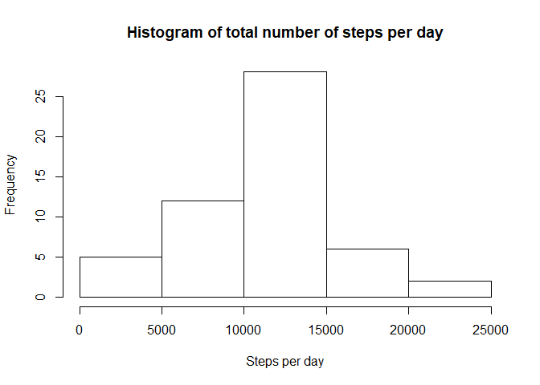
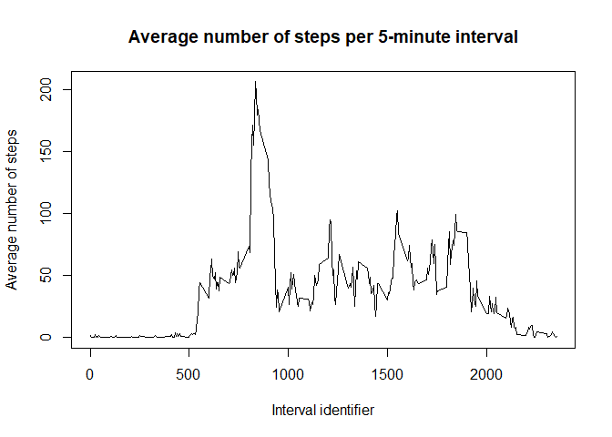
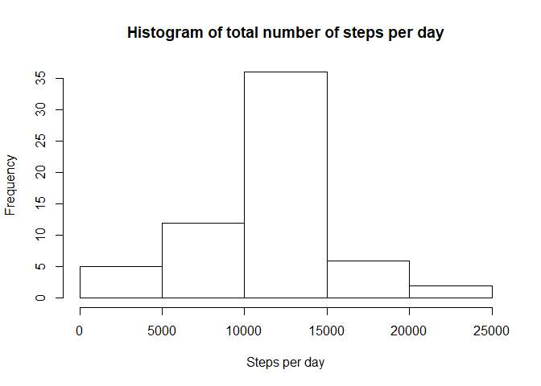
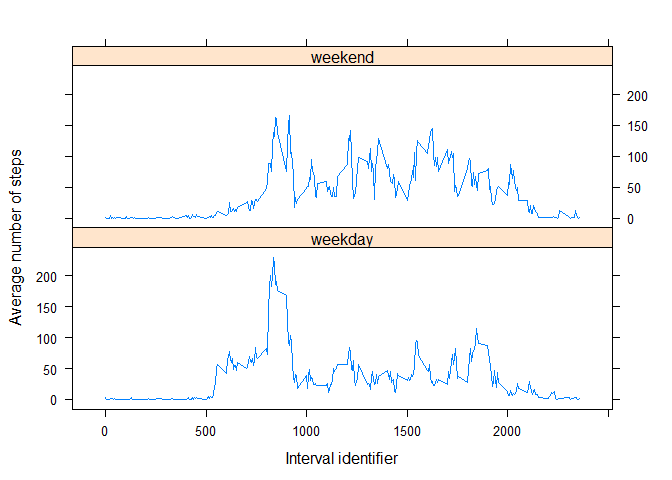

## Loading and preprocessing the data
First, we are going to unzip the dataset ad load the data from the csv file:


```r
unzip("activity.zip")
data <- read.csv("activity.csv")
data$date <- as.Date(data$date, format = "%Y-%m-%d")
```

Note that we convert the "date" column values to the Date class.

## What is mean total number of steps taken per day?

Next, we calculate the total number of steps per day using the `aggregate` function. We plot a histogram of the total number of steps per day and take the mean and the median of this value


```r
stepsPerDay <- aggregate(list(totalSteps = data$steps), by = list(date = data$date), FUN = sum)
hist(stepsPerDay$totalSteps, main = "Histogram of total number of steps per day", xlab = "Steps per day")
```

<!-- -->

```r
mean(stepsPerDay$totalSteps, na.rm = TRUE)
```

```
## [1] 10766.19
```

```r
median(stepsPerDay$totalSteps, na.rm = TRUE)
```

```
## [1] 10765
```


## What is the average daily activity pattern?

We also aggregate the data by the 5 minute interval, so that we can take average number of steps taken across all days, showing this result in a time series plot.


```r
averageStepsPerInterval <- aggregate(steps ~ interval, data, mean)
plot(averageStepsPerInterval$interval, averageStepsPerInterval$steps, type = "l", main = "Average number of steps per 5-minute interval", xlab = "Interval identifier", ylab = "Average number of steps")
```

<!-- -->

```r
intervalWithMaximumNumberOfStepsInAverage <- averageStepsPerInterval[averageStepsPerInterval$steps == max(averageStepsPerInterval$steps), "interval"]
```
We conclude that the 835th interval is the interval with the maximum number of steps in average. 

## Imputing missing values

To calculate the number of missing values in the dataset, we use the complete.cases function


```r
nrow(data[!complete.cases(data), ])
```

```
## [1] 2304
```

All the `NA` values come from the `steps` column


```r
nrow(data[is.na(data$steps), ])
```

```
## [1] 2304
```

We choose to fill the `NA` values in the `steps` column with the average number of steps in that particular 5-minute interval of the day.


```r
newData <- merge(data[is.na(data$steps), c("date", "interval")], averageStepsPerInterval, by = "interval")
```

Then, we recreate our original data by combining the rows that do not have `NA` with the data that has the average steps by interval instead of `NA` values:


```r
newData <- rbind(data[!is.na(data$steps), ], newData)
newData <- newData[order(newData$date), ]
```
Inspecting the `head` of the new data shows that the `NA` have been replaced


```
##        steps       date interval
## 1  1.7169811 2012-10-01        0
## 10 0.3396226 2012-10-01        5
## 17 0.1320755 2012-10-01       10
## 29 0.1509434 2012-10-01       15
## 33 0.0754717 2012-10-01       20
## 45 2.0943396 2012-10-01       25
```
To verify the impact of replacing the `NA`values, we plot a histogram of the total number of steps each day and take the mean and median of the total number of steps taken per day


```r
stepsPerDay <- aggregate(list(totalSteps = newData$steps), by = list(date = newData$date), FUN = sum)
hist(stepsPerDay$totalSteps, main = "Histogram of total number of steps per day", xlab = "Steps per day")
```

<!-- -->

```r
mean(stepsPerDay$totalSteps)
```

```
## [1] 10766.19
```

```r
median(stepsPerDay$totalSteps)
```

```
## [1] 10766.19
```
Compared with the results generated with the original data, We can see there is very little variation in the histogram shape and the median value.

## Are there differences in activity patterns between weekdays and weekends?

To find out the differences in activity patterns between weekdays and weekends we first subset our data using the weekday of the dates. 


```r
weekendData <- newData[as.POSIXlt(newData$date)$wday %in% c(0, 6), ]
weekdayData <- newData[!(as.POSIXlt(newData$date)$wday %in% c(0, 6)), ]
```
Next, we recombine the data adding a factor column that indicates if the date is a weekend or a weekday


```r
dayType <- factor(c("weekday", "weekend"))
newDataWithDayType <- rbind(cbind(weekendData, list(dayType = dayType[2])), cbind(weekdayData, list(dayType = dayType[1])))
```

Finally, we calculate the average number of steps per 5-minute interval during weekends and weekdays and plot these values in two graph panel, using the `lattice` library


```r
library(lattice)
averageStepsPerIntervalAndDayType <- aggregate(steps ~ interval + dayType, newDataWithDayType, mean)
xyplot(steps ~ interval | dayType, averageStepsPerIntervalAndDayType, type = "l", layout = c(1, 2), xlab = "Interval identifier", ylab = "Average number of steps")
```

<!-- -->
